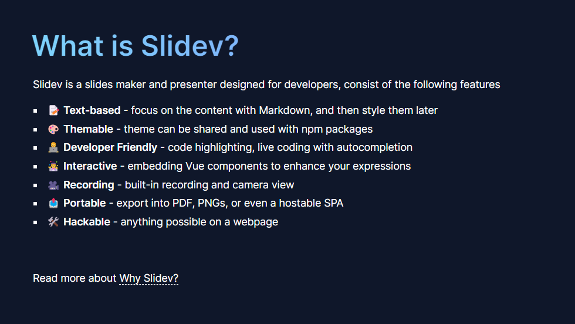
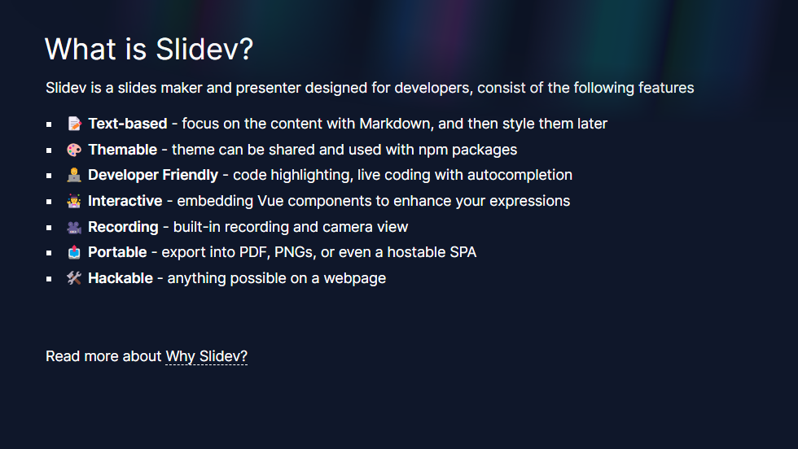
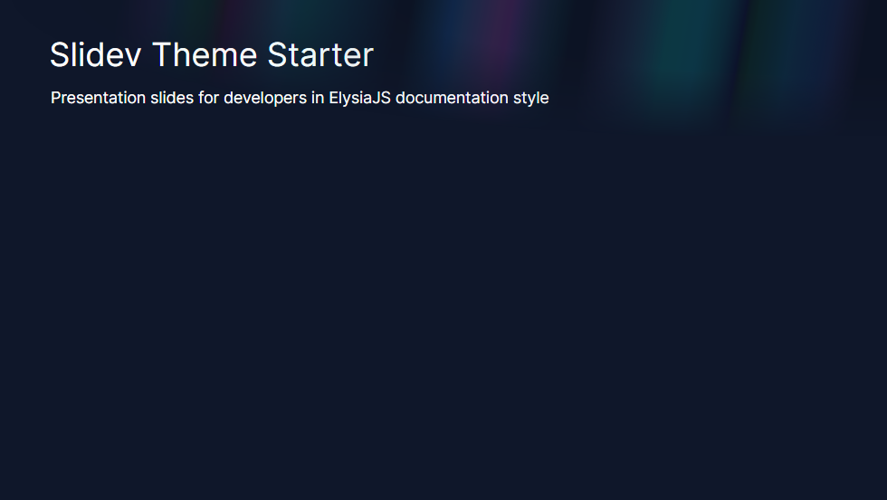
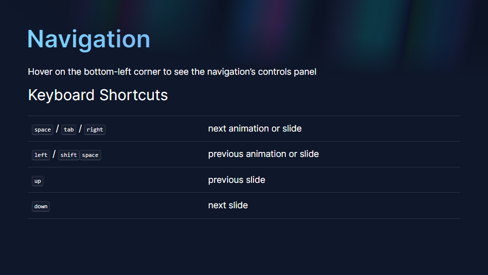
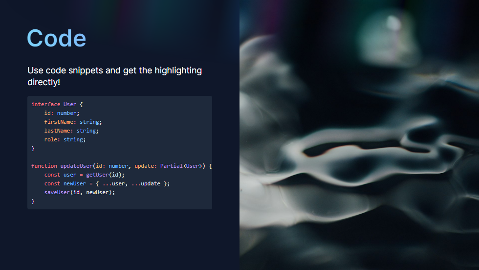
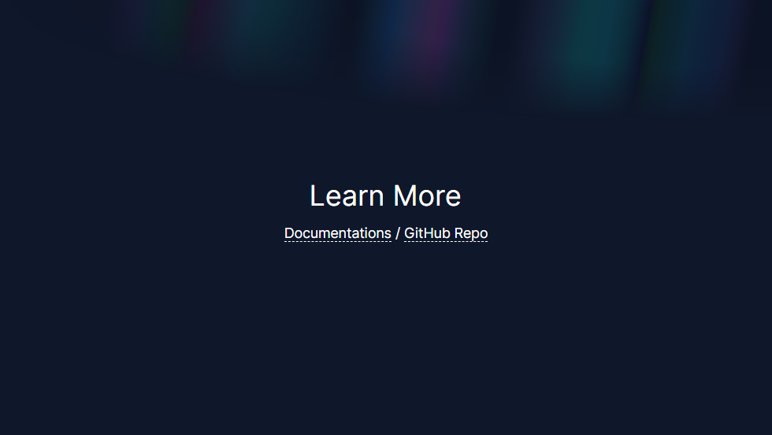
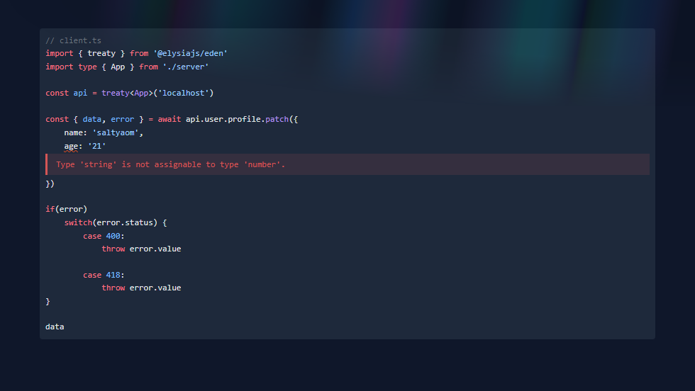
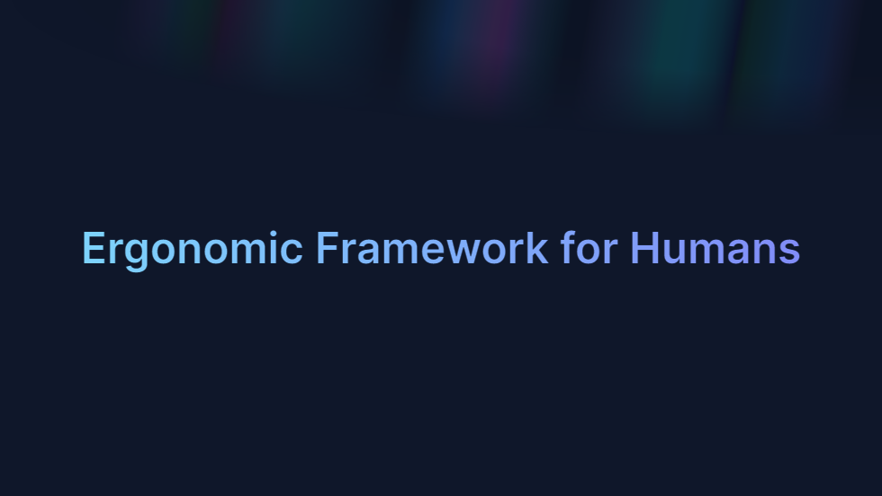
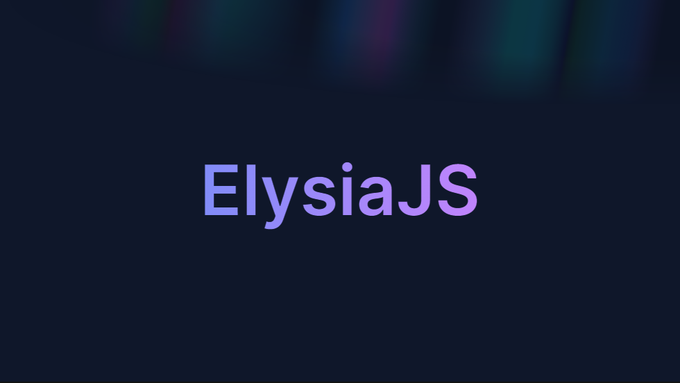
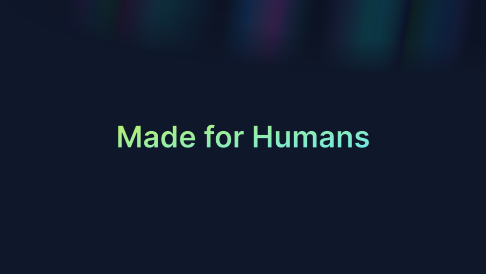

# slidev-theme-elysia

The [Slidev](https://sli.dev/) theme in [ElysiaJS](https://elysiajs.com/) documentation style.

-   [Demo](https://kravetsone.github.io/slidev-theme-elysia/)
-   [Screenshots](#screenshots)
-   [Ray Component](#use-a-ray-component)
-   [Styles](#styles)
-   [Code blocks + Twoslash](#code-blocks--twoslash)

## Install

Add the following frontmatter to your `slides.md`.

```yaml
---
theme: elysia
---
```

Start [Slidev](https://sli.dev/) and then it will prompt you to install the theme automatically or install via your's favorite package manager.

```bash
npm install slidev-theme-elysia
```

Learn more about [how to use a theme](https://sli.dev/themes/use).

### Use a Ray component

Ray component is a background light of [ElysiaJS](https://elysiajs.com/) documentation.

Create `global-top.vue` file (More about [global layers](https://sli.dev/custom/global-layers)) and paste it.

```html
<template>
    <Ray
        class="h-[150px] top-0 left-0 z-[100] opacity-25 dark:opacity-[.55] pointer-events-none"
        static
    />
</template>
```

Now each slide render a Ray component!

##### Without



##### With



## Screenshots

Screenshots with the [Ray Component](#use-a-ray-component).










### Code blocks + [Twoslash](https://twoslash.netlify.app/)

````md
```typescript twoslash
// @errors: 2322 1003
// @filename: server.ts
import { Elysia, t } from "elysia";

const app = new Elysia()
    .patch(
        "/user/profile",
        ({ body, error }) => {
            if (body.age < 18) return error(400, "Oh no");

            if (body.name === "Nagisa") return error(418);

            return body;
        },
        {
            body: t.Object({
                name: t.String(),
                age: t.Number(),
            }),
        }
    )
    .listen(80);

export type App = typeof app;

// @filename: client.ts
// ---cut---
// client.ts
import { treaty } from "@elysiajs/eden";
import type { App } from "./server";

const api = treaty<App>("localhost");

const { data, error } = await api.user.profile.patch({
    name: "saltyaom",
    age: "21",
});

if (error)
    switch (error.status) {
        case 400:
            throw error.value;
        //                         ^?

        case 418:
            throw error.value;
        //                         ^?
    }

data;
// ^?
```
````



### Styles

#### `.text-elysia-sky-indigo`

```html
<p class="text-elysia-sky-indigo">Ergonomic Framework for Humans</p>
```



#### `.text-elysia-indigo-purple`

```html
<p class="text-elysia-indigo-purple">ElysiaJS</p>
```



#### `.text-elysia-lime-cyan`

```html
<p class="text-elysia-lime-cyan">Made for Humans</p>
```


