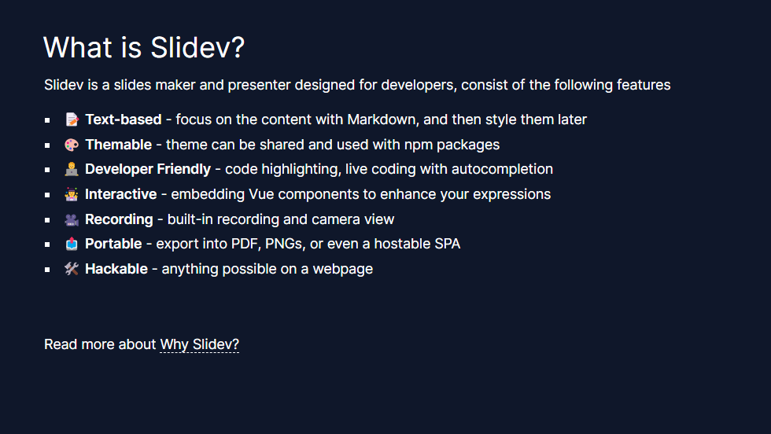
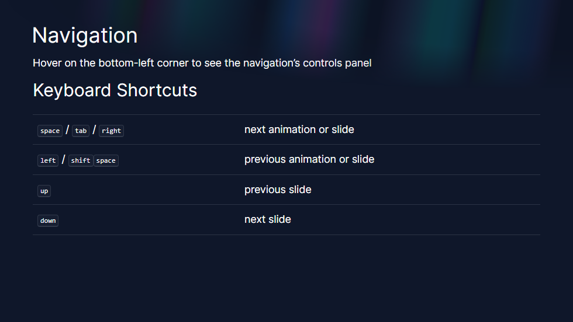
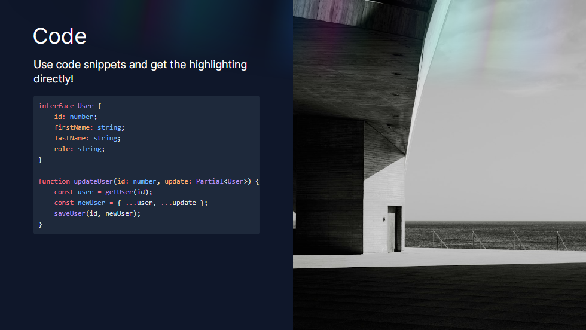

# slidev-theme-elysia

The [Slidev](https://sli.dev/) theme in [ElysiaJS](https://elysiajs.com/) documentation style.

[Demo](https://kravetsone.github.io/slidev-theme-elysia/). [Screenshots](#screenshots). [Ray Component](#use-a-ray-component).

## Install

Add the following frontmatter to your `slides.md`. Start Slidev then it will prompt you to install the theme automatically.

```yaml
---
theme: elysia
---
```

or install via your's favorite package manager

```bash
npm install slidev-theme-elysia
```

Learn more about [how to use a theme](https://sli.dev/themes/use).

### Use a Ray component

Ray component is a background of [ElysiaJS](https://elysiajs.com/) documentation.

Create `global-top.vue` component and paste it

```html
<template>
    <Ray class="h-[150px] top-0 left-0 z-[100] opacity-25 dark:opacity-[.55] pointer-events-none" static />
</template>
```

Now each slide render a Ray component!

##### Without



##### With


## Screenshots

Screenshots with the [Ray Component](#use-a-ray-component).







